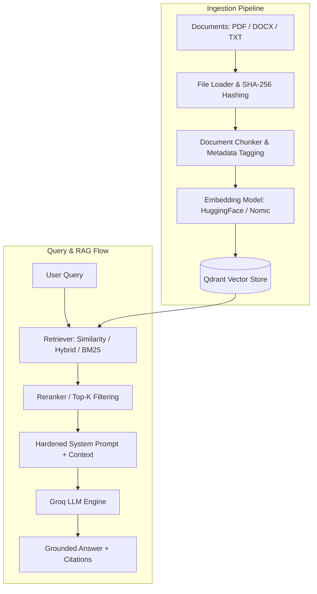

# Production-Ready RAG System

A modular, production-grade Retrieval-Augmented Generation (RAG) pipeline built with **FastAPI**, **LangChain**, **Qdrant**, and **Groq**. Engineered for enterprise document processing, hybrid retrieval, intelligent chunking, security-hardened prompting, and low-latency inference.

---

## Key Features

- **Document Ingestion & Deduplication**:
  - Multi-format support: PDF (`pypdf`), DOCX (`python-docx`), and plain text.
  - Document hashing (SHA-256) for content deduplication, versioning, and document tracking.
  - Configurable semantic chunking with overlap via `RecursiveCharacterTextSplitter`.
- **Vector Storage & Hybrid Retrieval**:
  - Vector search backed by **Qdrant** vector database.
  - Dense embeddings using HuggingFace / Nomic models (`nomic-embed-text`).
  - Extensible retrieval supporting similarity search, BM25 lexical matching, and query-context reranking.
- **LLM & Inference**:
  - High-throughput LLM integration via **Groq** (`ChatGroq`).
  - Configurable model parameters via Pydantic settings.
- **Prompt Defense & Guardrails**:
  - Prompt injection-resistant system prompt.
  - Mandatory strict grounding (no hallucinations; explicit "not found" fallback).
  - Source document and page citation enforcement.
  - Untrusted data isolation.
- **Scalable Configuration**:
  - Centralized settings powered by `pydantic-settings` reading from `.env`.

---

## Architecture Overview



---

## Project Structure

```text
Production-RAG/
├── app/
│   ├── core/
│   │   └── config.py          # Application configuration (Pydantic Settings)
│   ├── ingestion/
│   │   ├── chunker.py         # Document chunking & text splitting logic
│   │   ├── loaders.py         # Multi-format document loaders (PDF, DOCX, TXT)
│   │   └── pipeline.py        # End-to-end ingestion & indexing pipeline
│   ├── rag/
│   │   └── prompt.py          # Production system prompt & prompt templates
│   ├── retrieval/
│   │   ├── bm25.py            # BM25 sparse keyword retriever
│   │   ├── hybrid.py          # Dense + sparse hybrid retriever setup
│   │   ├── reranker.py        # Semantic reranking & scoring
│   │   └── vector_store.py    # Qdrant client & vector store interface
│   └── services/
│       ├── embedding.py       # Embedding model factory (HuggingFace)
│       └── llm.py             # LLM provider interface (Groq)
├── .env-template              # Environment variables template
├── .gitignore                 # Git ignore configuration
├── README.md                  # Project documentation
└── requirements.txt           # Python package dependencies
```

---

## Getting Started

### 1. Prerequisites

- **Python**: 3.10 or higher
- **Qdrant**: Running locally or via cloud (`http://localhost:6333`)
  ```bash
  docker run -p 6333:6333 -p 6334:6334 qdrant/qdrant
  ```
- **Redis** *(optional / caching)*: Running on `localhost:6379`
- **Groq API Key**: [Obtain from Groq Console](https://console.groq.com/)

---

### 2. Installation

1. **Clone the repository**:
   ```bash
   git clone <repository-url>
   cd Production-RAG
   ```

2. **Create and activate a virtual environment**:
   - **Linux / macOS**:
     ```bash
     python3 -m venv .venv
     source .venv/bin/activate
     ```
   - **Windows (PowerShell)**:
     ```powershell
     python -m venv .venv
     .venv\Scripts\Activate.ps1
     ```

3. **Install dependencies**:
   ```bash
   pip install -r requirements.txt
   ```

---

### 3. Environment Configuration

Copy the `.env-template` file to `.env` and fill in your credentials:

```bash
cp .env-template .env
```

#### Environment Variables

| Variable | Description | Default |
| :--- | :--- | :--- |
| `GROQ_API_KEY` | API Key for Groq Cloud LLMs | *Required* |
| `LLM_MODEL` | Groq LLM model name | `qwen/qwen3.8-27b` |
| `EMBEDDING_MODEL` | HuggingFace embedding model | `nomic-embed-text` |
| `QDRANT_URL` | Qdrant vector database URL | `http://localhost:6333` |
| `QDRANT_COLLECTION`| Target collection name | `prod_rag` |
| `REDIS_URL` | Redis instance connection string | `redis://localhost:6379/0` |
| `DATABASE_URL` | Relational database URL (PostgreSQL/SQLite) | - |
| `CHUNK_SIZE` | Chunk character length | `800` |
| `CHUNK_OVERLAP` | Chunk overlap character length | `120` |
| `RETRIEVAL_TOP_K` | Initial number of documents retrieved | `20` |
| `FINAL_TOP_K` | Final number of documents after reranking | `5` |

---

## Usage Guide

### Ingesting Documents

You can index documents (PDF, DOCX, or TXT) into Qdrant using the ingestion pipeline:

```python
from app.ingestion.pipeline import ingest_documents

result = ingest_documents("path/to/document.pdf")
print(result)
# Output: {'document_id': '<sha256_hash>', 'file_name': 'document.pdf', 'chunks': 24}
```

### Querying the RAG Pipeline

```python
from app.rag.prompt import RAG_PROMPT
from app.retrieval.hybrid import get_retriever
from app.services.llm import get_llm

retriever = get_retriever()
llm = get_llm()

# 1. Retrieve relevant chunks
query = "What is the system's fault tolerance strategy?"
docs = retriever.invoke(query)
context = "\n\n".join([doc.page_content for doc in docs])

# 2. Generate grounded response
chain = RAG_PROMPT | llm
response = chain.invoke({"context": context, "question": query})

print(response.content)
```

---

## Security & Guardrails

1. **Prompt Injection Protection**: The system prompt explicitly treats all retrieved document chunks as untrusted data and strictly instructs the LLM to ignore any imperative commands embedded inside documents.
2. **Hallucination Mitigation**: The model is restricted to only answer from context. If the answer is missing, it returns a deterministic fallback rather than generating unverifiable claims.
3. **Traceability**: All ingested chunks carry source metadata (document hash, filename, page numbers) to provide auditability and citations for all answers.

---

## License

This project is licensed under the MIT License.
